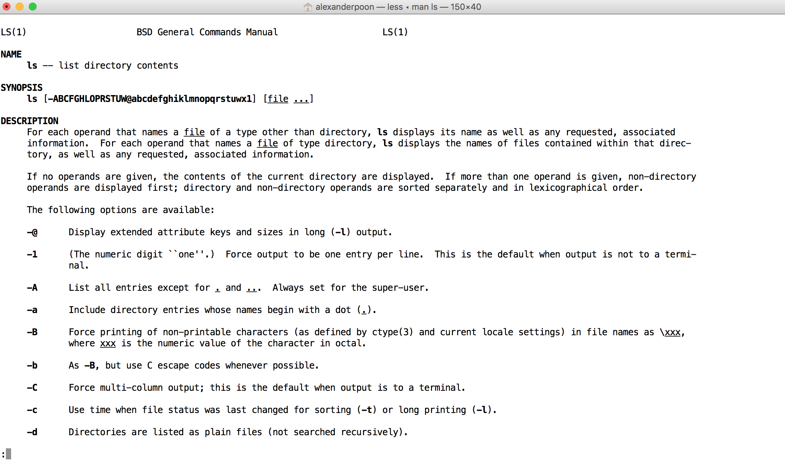

``` {r setup, include = FALSE}
knitr::opts_chunk$set(echo = TRUE, message = FALSE, warning = FALSE)
```

## What is `git` ?

From https://git-scm.com/:

> Git is a free and open source distributed version control system designed to handle everything from small to very large projects with speed and efficiency.

## What is 'version control'?

Like track changes + a super save button.

&nbsp;

. . .

With `git`, you can:

> * See what your files look like at earlier save points
> * See what's changed since last save
> * Revert to earlier version of saved files

## When should you use `git`?

> * You want to track changes to your code over time
> * You want a backup of your code
> * You want others to see your code
> * You want others to use your code

## Setup

Download `git` at:

Windows: https://git-scm.com/download/win  
macOS: https://git-scm.com/download/mac

&nbsp;

Sign up for an account at https://github.com/

## The shell

To use `git`, we're going to work in the shell.

. . .

"Shell" ≈ "bash" ≈ "Command Line" ≈ "Terminal" ≈ "tty" ≈ "Console"

. . .

= A way to tell your computer to do things with commands, rather than clicks.

. . .

&nbsp;

[See https://unix.stackexchange.com/questions/4126/what-is-the-exact-difference-between-a-terminal-a-shell-a-tty-and-a-con for the technical details]

## The shell


## Working directory

At all times, you are in a **working directory**. `pwd` returns your current working directory:

`$ pwd`

. . .

`/Users/alexanderpoon`

&nbsp;

[This is your home directory, also denoted by `~`]

## What's in my working directory?

`ls` lists what's in your working directory:

`$ ls`

. . .

    Applications/ Desktop/ Documents/ Downloads/ Dropbox/ Library/ Movies/
    Music/ Pictures/ Public/

## Command Options

Shell commands have options that alter their behavior:

`$ ls -l`

. . .

    drwx------ 7 alexanderpoon staff 238B May 22 12:52 Applications/
    drwx------+ 13 alexanderpoon staff 442B Jun 23 11:17 Desktop/
    drwx------+ 5 alexanderpoon staff 170B Mar 28 15:12 Documents/
    drwx------+ 4 alexanderpoon staff 136B Jun 18 17:28 Downloads/
    drwx------@ 10 alexanderpoon staff 340B Apr 28 14:43 Dropbox/
    drwx------@ 71 alexanderpoon staff 2.4K Jun 13 14:11 Library/
    drwx------+ 3 alexanderpoon staff 102B Aug 18 2014 Movies/
    drwx------+ 7 alexanderpoon staff 238B Dec 14 2015 Music/
    drwx------+ 7 alexanderpoon staff 238B Oct 4 2015 Pictures/
    drwxr-xr-x+ 6 alexanderpoon staff 204B Jul 18 2016 Public/

## Documentation for shell commands

For shell commands, access documentation with `man` (useful for options):

`$ man <name of command>`

(in Git Bash `<name of command> --help`)

. . .

&nbsp;

[Hit `q` to exit the documentation]

## Documentation for shell commands

`$ man ls`



## Create a folder

Git repositories live inside a folder. Create a folder with `mkdir`:

`$ mkdir Desktop/myFirstRepo`

## Navigating to another directory

Change your working directory with `cd`. Specify paths relative to your current working directory:

`$ cd Desktop/myFirstRepo`

. . .

or with an absolute path:

`$ cd /Users/alexanderpoon/Desktop/myFirstRepo`

## Summary of shell commands

* `pwd` - show working directory
* `cd` - change working directory
* `ls` - list contents of a directory
* `mkdir` - create a new folder
* `man` - documentation (macOS and Linux)
* `<name of command> --help` - documentation (Windows)

## Bonus

* `r knitr::asis_output("\U2191")` - pull up prior commands
* `clear` - clear your window
* `cat` - print something
* `touch` - create a new file
* `rm` - delete a file
* `rmdir` - delete an empty folder
* `rm -rf` - delete a non-empty folder and its contents (use with caution!)
* `mv` - move a file
* `cp` - copy a file
* `~` - home directory (as in `cd ~`)
* `..` - parent directory (as in `cd ..`)

More here: https://gist.github.com/LeCoupa/122b12050f5fb267e75f

## `git`


## Configuring `git`

`$ git config --global user.name your_username`
`$ git config --global user.email your_email`

Do this once, when starting to use `git` on a new computer.

## Commits

The fundamental `git` operation is the `commit`, which tells `git`: "remember what my files look like at this point".

. . .


With `git`, you can:

* See what files look like at earlier commits
* See what's changed since last commit
* Revert to version of saved files at prior commits

## Commits

Steps before committing:

1. Navigate to directory where you want to use version control
2. Initialize a `git` repository
3. Tell `git` which files to track

## Start using version control

Initialize a `git` repository with `git init`:

`$ git init`

. . .

    Initialized empty Git repository in /Users/alexanderpoon/Desktop/
    myFirstRepo/.git/

## Start using version control


## Start using version control

We need some files to work with version control:

`$ echo "# A new file" > first.txt`

&nbsp;

> * \> is a pipe operator that passes the output of one command to a file

## Check status of your git repository

At any time, check the status of a `git` repository with `git status`:

`$ git status`

. . .

    On branch master

    Initial commit

    Untracked files:
    (use "git add <file>..." to include in what will be committed)

        first.txt

## Prepare a commit

Git doesn't track anything by default. Tell it to start tracking files with `git add`:

`$ git add first.txt`

## Prepare a commit

Check the status again:

`$ git status`

    On branch master

    Initial commit

    Changes to be committed:
    (use "git rm --cached <file>..." to unstage)

	new file:   first.txt

## First commit!

Now we're ready to commit with `git commit`. Add flag `-m` with a message describing what we're committing (mandatory):

`$ git commit -m 'my first commit'`

. . .

    [master (root-commit) a8d0ec1] my first commit
    1 file changed, 1 insertion(+)
    create mode 100644 first.txt

&nbsp;

. . .

After committing, `git` will track changes to `first.R` going forward.

## First commit!

Check status again:

`$ git status`

    On branch master
    nothing to commit, working tree clean

## More commits

Edit existing file:

`$ echo "# A new line" >> first.txt`

> * \>\> is a pipe operator that appends the output of one command to a file

. . .

Add some more stuff:

`$ mkdir subfolder`  
`$ cd subfolder`  
`$ echo "# New file one" > one.txt`  
`$ echo "# New file two" > two.txt`  
`$ cd ..`  

## More commits

Check status again:

    On branch master
    Changes not staged for commit:
    (use "git add <file>..." to update what will be committed)
    (use "git checkout -- <file>..." to discard changes in working directory)
    
    	modified:   first.txt
    
    Untracked files:
    (use "git add <file>..." to include in what will be committed)
    
    	subfolder/

## More commits

You can `git add` individual files:

`$ git add first.txt`

. . .

Or entire subfolders:

`$ git add subfolder/`

. . .

Or everything all at once:

`$ git add .`

&nbsp;

. . .

[`$ git help add` to read documentation]

## A note on `git add`

> * The first use of `git add` on a file tells git to start tracking that file
> * Subsequent uses of `git add` tells `git` to reflect changes to that file in next commit  
## More commits

Commit these changes:

`$ git status`

    On branch master
    Changes to be committed:
      (use "git reset HEAD <file>..." to unstage)
    
    	modified:   first.txt
    	new file:   subfolder/one.txt
    	new file:   subfolder/two.txt

. . .

`$ git commit -m 'add subfolder'`

## Make one more change and commit

`$ echo "# Another new line" >> first.txt`
`$ git add first.txt`
`$ git commit -m 'really important update'`

## What do my prior commits look like?

View your commit history with `git log`:

`> git log`

. . .

    commit ec19e8c7a0234474d5c06c9366f550f48b3ab547
    Author: alexander-poon <alexander.poon@vanderbilt.edu>
    Date:   Tue Jun 27 14:29:22 2017 -0500

        really important update

    commit 6a7849789a03fa0324d690baa23bdd476a56e234
    Author: alexander-poon <alexander.poon@vanderbilt.edu>
    Date:   Tue Jun 27 14:29:22 2017 -0500

        add subfolder

    commit 34a35301edc07d9e996364fedfaf5b085dc42f87
    Author: alexander-poon <alexander.poon@vanderbilt.edu>
    Date:   Tue Jun 27 14:29:22 2017 -0500

        my first commit
        
## Oops, I made a mistake

Undo a commit with `git revert`:

`$ git revert ec19e8c --no-edit`

where is the first 7 characters of the SHA hash of the commit you want to undo. 

. . .

This creates a new commit where the state of files will be that prior to the specified commit.

## Oops, I made a mistake

Check this is the case with `git log`:

`$ git log`

    commit ef61aaeeda1a848815a49c23991758005683c8f0
    Author: alexander-poon <alexander.poon@vanderbilt.edu>
    Date:   Tue Jun 27 14:37:31 2017 -0500

        Revert "really important update"
    
        This reverts commit ec19e8c7a0234474d5c06c9366f550f48b3ab547.

    commit ec19e8c7a0234474d5c06c9366f550f48b3ab547
    Author: alexander-poon <alexander.poon@vanderbilt.edu>
    Date:   Tue Jun 27 14:29:22 2017 -0500

        really important update

    commit 6a7849789a03fa0324d690baa23bdd476a56e234
    Author: alexander-poon <alexander.poon@vanderbilt.edu>
    Date:   Tue Jun 27 14:29:22 2017 -0500

        add subfolder

    commit 34a35301edc07d9e996364fedfaf5b085dc42f87
    Author: alexander-poon <alexander.poon@vanderbilt.edu>
    Date:   Tue Jun 27 14:29:22 2017 -0500

        my first commit

## Oops, I made a mistake

Check this is the case with `cat`:

`$ cat first.txt`

    # A new file
    # A new line

## Remote repositories

Everything we've done thus far is local to our machines. A lot of the power of `git` comes through publishing code with remote repositories on the internet.

## Remote repositories


## Remote repositories

Point your local repository to a remote repository on GitHub with `git remote add`:

`$ git remote add origin https://github.com/alexander`
`-poon/myFirstRepo.git`

&nbsp;

. . .

'origin' is a shorthand name for your remote repository (call it whatever you want)

## Remote repositories

Push changes to the remote repository with `git push`:

`$ git push origin master`

&nbsp;

. . .

`origin` is the name of the remote repository that you specified with `git remote add`

## Remote repositories


## Remote repositories

Just like your local repository, your GitHub repository has your entire commit history. Github also provides:

* Ability to make a copy of any GitHub repository
* Issues and documentation of your code/projects

## Clean up

Delete this folder with:

`$ cd ..`  
`$ rm -rf myFirstRepo`

## Git workflow (First time around)

1) Create a local repository
2) Create files in repository
3) `git add` one or more files to start tracking changes
4) Add one or more `commit`s
5) Point local repository to remote repository
6) `push` to remote

## Git workflow (ongoing)

1) Modify files
2) `git add` one or more files to `commit`
3) Add one or more `commits`
4) `push` changes to remote

## Cloning a GitHub repository

Create a copy of a GitHub repo in your working directory:

`git clone https://github.com/some-user/repo.git`

&nbsp;

> * This creates a local copy of a GitHub repo, tied to that remote repository
> * In particular, this means that you can update your local copy if the remote changes
> * If you have write access to that remote repository, you can also `push` changes to that remote

## References

* Learn the Command Line via Codecademy https://www.codecademy.com/learn/learn-the-command-line
* Official git documentation
https://git-scm.com/book/en/v2
